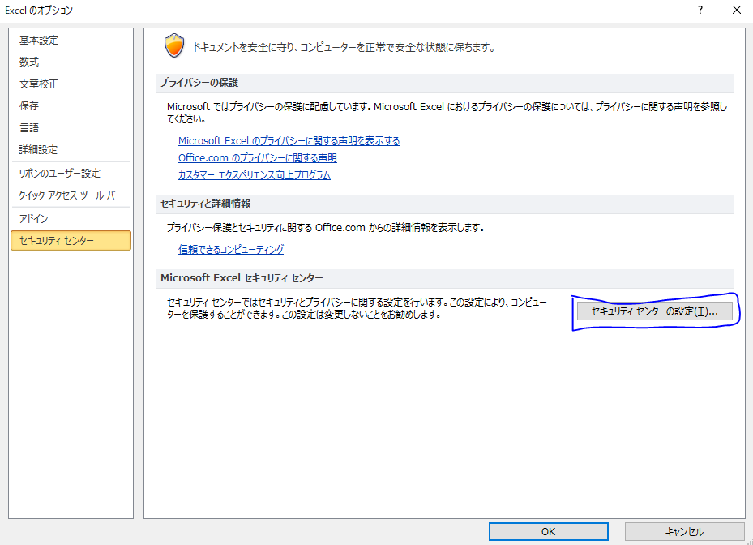
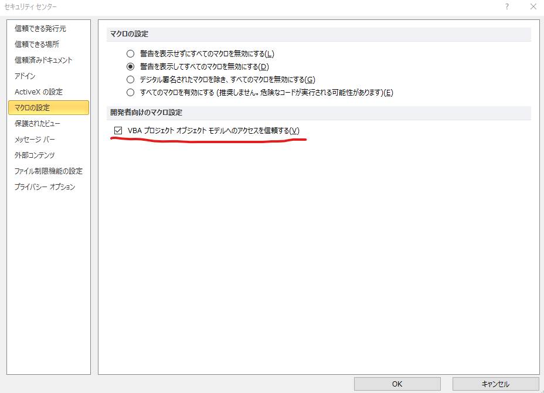

# Aggr
> Merge data you want to (only if you have a Excel sheet).

　同じフォーマットで記載されているエクセルのデータをまとめて一つのシートにまとめるマクロです。
何故、ここまでしてエクセルとマクロにこだわるのか。データベースソフトウェアでそろそろいいんじゃないか、楽になったらいいんじゃないか？
## Features (全て予定)
- 設定ファイル：シート名*config*を読み込み、動作を変更。マクロを触らずに振る舞いを変えることができる
- ルール設定：合体の対象が保存されているディレクトリや、そのディレクトリにあっても取り込み対象ではない除外ルール、ファイル名の命名規則等でルールを設定し、複雑な条件下でシートを取り込むことができる
- 柔軟なシート設定：定義済みテーブルまたは「シート名と開始行、先頭列と終端列」の情報をもとに、情報を取り込み
- 任意の列をカテゴリと見なし、カテゴリ別でシートを複製する
- 取り込み後の編集と同期：書き出した後、取り込み元のファイルに同じ情報を書き戻す

## 注意
使用にあたっては、セキュリティセンターにて、マクロの設定の中にある開発者向けのマクロ設定、**VBA プロジェクトオブジェクトモデルへのアクセスを信頼する**にチェックを入れてください。

## License

To the extent possible under law, [Matias Singers](http://mts.io) has waived all copyright and related or neighboring rights to this work.
